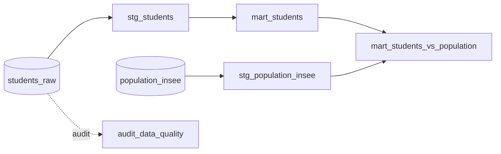

# Pipeline dbt : profils sociodémographiques


Projet dbt qui analyse l'évolution du profil (âge, genre, région) des étudiants d'une plateforme de formation en ligne sur 4 ans, et le compare à la population française (données INSEE).

Le pipeline a été conçu sur Snowflake. Je l'ai rendu reproductible en local avec DuckDB : on clone le repo, on lance `dbt build`, et tout se construit avec les tests, sans aucune base cloud.

## Lancer le projet

```bash
python -m venv .venv && source .venv/bin/activate
pip install -r requirements.txt
dbt deps
dbt build --profiles-dir .
```

Ça charge les données, construit les modèles et exécute les 26 tests.

## Structure



| Couche | Modèle | Rôle |
|---|---|---|
| staging | `stg_students` | nettoyage des inscriptions |
| staging | `stg_population_insee` | population INSEE de référence |
| marts | `mart_students` | agrégation par année / âge / genre / région |
| marts | `mart_students_vs_population` | croisement INSEE → taux pour 10 000 hab |
| audit | `audit_data_quality` | contrôle de complétude source → final |

## Ce que j'ai soigné

**Les valeurs manquantes.** Le genre manque sur 27 % des lignes. Plutôt que de supprimer ces lignes et perdre un quart des données, je les garde avec une valeur `Non renseigné`. Le modèle `audit_data_quality` mesure la complétude (et confirme qu'aucune ligne n'est supprimée).

**Le grain.** Un étudiant peut démarrer un parcours sur plusieurs années. La clé unique n'est donc pas l'identifiant seul, mais l'identifiant + l'année, testé avec `unique_combination_of_columns`.

**La comparaison INSEE.** Je ne croise que les hommes et les femmes, car l'INSEE ne distingue que ces deux modalités. Les `Non renseigné` restent dans l'analyse interne mais sortent du calcul de taux.

**Le RGPD.** Les identifiants sont pseudonymisés et n'apparaissent jamais dans les tables finales (tout est agrégé).

## Ce que les données disent

- 4 647 inscriptions sur 2022-2025
- à peine 1 femme sur 3, et c'est stable sur les 4 ans
- un public en reconversion : 6 inscrits sur 10 ont entre 25 et 39 ans
- l'Île-de-France est environ 3× au-dessus de la moyenne des autres régions, à population égale

## Stack

dbt-core · DuckDB (local) · Snowflake (production) · dbt_utils

---

*Données pseudonymisées. Source de référence : INSEE, population 2023.*
