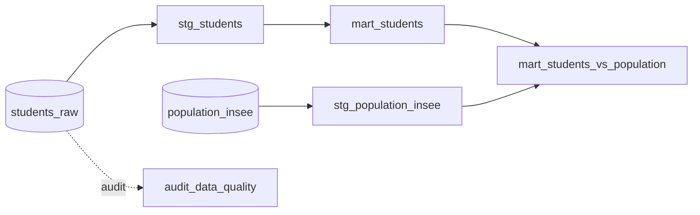

# ⚙️ Pipeline dbt : profils sociodémographiques


Pipeline de transformation dbt qui analyse l'évolution du profil (âge, genre, région) des étudiants des parcours Data d'une plateforme de formation, sur 4 ans, et le compare à la population française (données INSEE). Conçu sur Snowflake, **reproductible en local avec DuckDB en une seule commande**.

---

## 📖 Contexte

Une plateforme de formation en ligne veut mieux connaître ses étudiants des parcours Data et suivre l'évolution de leur profil, pour nourrir sa réflexion sur l'accessibilité et l'égalité des chances.

**La mission :** préparer et fiabiliser les données internes, les enrichir avec une source publique (INSEE), et produire une table d'analyse exploitable et documentée.

---

## 🎯 Objectifs

- Nettoyer et structurer les inscriptions (couche staging)
- Agréger le profil par année, âge, genre et région (couche mart)
- Comparer les étudiants à la population française (taux pour 10 000 habitants)
- Garantir la fiabilité des données par des tests automatisés

---

## 🏗️ Architecture



| Couche | Modèle | Rôle |
|---|---|---|
| staging | `stg_students` | nettoyage des inscriptions |
| staging | `stg_population_insee` | population INSEE de référence |
| marts | `mart_students` | agrégation par année / âge / genre / région |
| marts | `mart_students_vs_population` | croisement INSEE (taux pour 10 000 hab) |
| audit | `audit_data_quality` | contrôle de complétude source vers final |

---

## 🔍 Résultats clés

### 1️⃣ Volume
**4 647 inscriptions** sur 2022-2025, avec un creux en 2023 puis une reprise en 2025.

### 2️⃣ Genre
**À peine 1 femme sur 3**, et c'est stable sur les 4 ans.

### 3️⃣ Âge
Public en reconversion : **6 inscrits sur 10 ont entre 25 et 39 ans**.

### 4️⃣ Région
Forte concentration : à population égale, l'**Île-de-France est environ 3× au-dessus de la moyenne** des autres régions.

---

## 🧪 Qualité et choix techniques

**Valeurs manquantes.** Le genre manque sur 27 % des lignes. Plutôt que de supprimer ces lignes et perdre un quart des données, je les conserve avec une valeur `Non renseigné`. Le modèle `audit_data_quality` mesure la complétude et confirme qu'aucune ligne n'est supprimée.

**Grain.** Un étudiant peut démarrer un parcours sur plusieurs années. La clé unique n'est donc pas l'identifiant seul, mais l'identifiant + l'année, vérifié par `unique_combination_of_columns`.

**Comparaison INSEE.** Je ne croise que les hommes et les femmes (l'INSEE ne distingue que ces deux modalités). Les `Non renseigné` restent dans l'analyse interne mais sortent du calcul de taux.

**RGPD.** Les identifiants sont pseudonymisés et n'apparaissent jamais dans les tables finales (tout est agrégé).

**Tests (26).** `not_null`, `accepted_values`, plages de valeurs, unicité de clé composite, et un test métier (aucun segment ne peut compter plus d'étudiants que d'habitants).

---

## ▶️ Reproduire en local

```bash
python -m venv .venv && source .venv/bin/activate
pip install -r requirements.txt
dbt deps
dbt build --profiles-dir .
```

Cela charge les données, construit les modèles et exécute les 26 tests. La base `demographics.duckdb` est générée localement, sans aucune infrastructure cloud.

---

## 📂 Structure du projet

```
models/
  staging/   stg_students · stg_population_insee
  marts/     mart_students · mart_students_vs_population
  audit/     audit_data_quality
seeds/       students_raw · population_insee
tests/       assert_no_segment_exceeds_population
```

---

## 🛠️ Stack

dbt-core · DuckDB (local) · Snowflake (production) · dbt_utils · SQL

> Données pseudonymisées. Source de référence : INSEE, population 2023.
